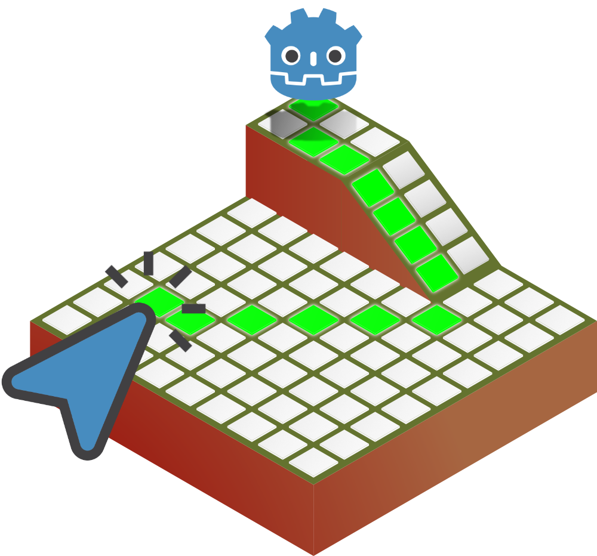

[](https://godotengine.org/asset-library/asset/4372)
[](https://www.patreon.com/c/vivensoft/)  
[](https://ko-fi.com/antoinecharruel)  
[](https://www.instagram.com/vsftgamedev/)

# Interactive Grid GDExtension



InteractiveGrid is a Godot 4.5 GDExtension that allows player interaction with a 3D grid, including cell selection, pathfinding, and hover highlights.

## Features

- Fully compatible with Godot 4.5.
- Highlight cells when hovering the mouse over them.
- Select individual cells.
- Detect obstacles (collision mask configurable from the editor).
- Align cells with the floor (collision mask configurable from the editor).
- Hide distant cells to focus on the relevant area.
- Calculate paths from a global position to selected cells using [AStar2D](https://docs.godotengine.org/en/stable/classes/class_astar2d.html).
- Choose movement type: orthogonal (4 directions) or diagonal (8 directions) directly from the editor.
- Customize the grid from the editor: grid size, cell size, mesh, colors, and shaders.
- High performance using [MultiMeshInstance3D](https://docs.godotengine.org/en/4.4/classes/class_multimeshinstance3d.html) for efficient rendering of multiple cells.

📄 [Download the full Interactive Grid GDExtension demo PDF](https://raw.githubusercontent.com/antoinecharruel/interactive_grid_gdextension/main/addons/interactive-grid/demo.pdf)

## Demo Example GDScript

```python
# File: interactive_grid.gd
#
# Summary: Script extending InteractiveGrid to handle player interaction with the grid.
#
# Node: InteractiveGrid (InteractiveGrid).
#
# Last modified: October 04, 2025
#
# This file is part of the InteractiveGrid GDExtension Source Code.
# Repository: https://github.com/antoinecharruel/interactive_grid_gdextension
#
# Version InteractiveGrid: 1.0.1
# Version: Godot Engine v4.5.stable.steam - https://godotengine.org
#
# Author: Antoine Charruel
# =================================================================================================

extends InteractiveGrid

@onready var pawn: CollisionShape3D = $"../Pawn"
@onready var ray_cast_from_mouse: RayCast3D = $"../RayCastFromMouse"
@onready var camera_3d: Camera3D = $"../Camera3D"

func _ready() -> void:
	# /*F+F++++++++++++++++++++++++++++++++++++++++++++++++++++++++++++++++++++++++++++++++++++++++
	# Summary: Called when the node enters the scene tree for the first time.
	#
	# Last Modified: October 04, 2025
	
	pass
	# ----------------------------------------------------------------------------------------F-F*/

func _process(delta: float) -> void:
	# /*F+F++++++++++++++++++++++++++++++++++++++++++++++++++++++++++++++++++++++++++++++++++++++++
	# Summary: Called every frame. 'delta' is the elapsed time since the previous frame.
	#
	# Last Modified: October 04, 2025
	
	if pawn != null:
		# Highlight the cell under the mouse.
		if self.get_selected_cells().is_empty():
			self.highlight_on_hover(ray_cast_from_mouse.get_ray_intersection_position())
	# ----------------------------------------------------------------------------------------F-F*/
	
func _input(event):
	# /*F+F++++++++++++++++++++++++++++++++++++++++++++++++++++++++++++++++++++++++++++++++++++++++
	# Summary: Handles mouse input events for the InteractiveGrid.
	#
	# Last Modified: October 04, 2025
	
	if event is InputEventMouseButton and event.button_index == MOUSE_BUTTON_RIGHT:
	# --------------------------------------------------------------------
	#  RIGHT MOUSE CLICK.
	# --------------------------------------------------------------------
		if event.pressed:
			print("Right button is held down at ", event.position)
			
			if pawn != null:
				# Makes the grid visible.
				self.set_grid_visible(true)
				# Centers the grid.
				# ! Info: every time center is called, the state of the cells is reset.
				self.center(pawn.global_position)
				 # Hides distant cells.
				var index_pawn_cell: int = self.get_cell_index_from_global_position(pawn.global_position)
				self.hide_distant_cells(index_pawn_cell, 6)
		else:
			print("Right button was released")


	if event is InputEventMouseButton and event.button_index == MOUSE_BUTTON_LEFT:
	# --------------------------------------------------------------------
	#  LEFT MOUSE CLICK.
	# --------------------------------------------------------------------
		if event.pressed:
			print("Left button is held down at ", event.position)
			
			if pawn != null:
				# Select a cell.
				if self.get_selected_cells().is_empty():
					self.select_cell(ray_cast_from_mouse.get_ray_intersection_position())
				
				# Retrieve the selected cells.
				var selected_cells: Array = self.get_selected_cells()
				if selected_cells.size() > 0:
					print("Selected cell index: ", selected_cells[0])
					print("Selected cells: ", selected_cells)
					print("Position of the selected cell: ", self.get_cell_golbal_position(selected_cells[0]))

					var cell_index_pawn = self.get_cell_index_from_global_position(self.get_grid_center_position())
					print("Pawn index: ", cell_index_pawn)
					
					# Retrieve the path.
					var path: PackedInt64Array
					path = self.get_path(cell_index_pawn, selected_cells[0]) # only the first one.
					#path = self.get_path(cell_index_pawn, self.get_latest_selected()) \# the last one.
					print("Last selected cell:", self.get_latest_selected())
					print("Path:", path)
					
					# Highlight the path.
					self.highlight_path(path)
		else:
			print("Right button was released")
	# ----------------------------------------------------------------------------------------F-F*/	
```
